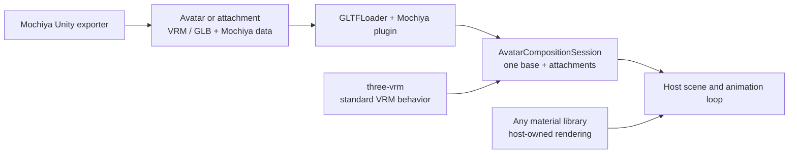

# Mochiya Avatar Composition

Compose a base avatar with clothing, hair and other **attachments** in Three.js, with reversible rig binding, fit settings and controls. This package is the maintenance home of the **`MOCHIYA_avatar_composition` glTF extension**, its schema and runtime behavior.



## Avatar or attachment

The runtime follows the Unity exporter's declared kind, including when an attachment contains a humanoid rig.

| `assetKind`  | Unity export rule                                                                                                     | Runtime role                                   |
| ------------ | --------------------------------------------------------------------------------------------------------------------- | ---------------------------------------------- |
| `avatar`     | Own VRM-compatible humanoid and no external Modular Avatar (MA) dependency. May include clothing and child armatures. | Session base; included content stays together. |
| `attachment` | Needs its direct parent's humanoid or has external MA dependencies/effects. That parent must be a valid avatar.       | Added with `session.attach()`.                 |

Both converted kinds carry the extension when exported through Mochiya. Conversion preserves separate armatures; MA owns Unity-side merging. Files without the extension can use host-selected roles and bone-name attachment, without recovered MA actions.

## Extension capabilities

`MOCHIYA_avatar_composition` **0.1** stores MA-style component instructions at the glTF document root. The runtime resolves them against a selected base when an attachment is added. Standard skinning, VRM expressions/physics and material rendering keep their own formats and owners.

| Component        | Converted Unity source                                     | Runtime capability and limit                                                                                                                                                                  |
| ---------------- | ---------------------------------------------------------- | --------------------------------------------------------------------------------------------------------------------------------------------------------------------------------------------- |
| `mergeArmature`  | **MA Merge Armature**; generated parent reference rig      | Store roots, prefix/suffix and settings; discover matching bones at attachment time. Unidirectional following with retained skins/rest offsets. Other lock modes warn and use that direction. |
| `boneProxy`      | **MA Bone Proxy**; generated external VRC collider anchors | Follow a base target with Keep World Pose or At Root. Partial-pose/scale modes warn and keep world pose.                                                                                      |
| `shapeChanger`   | **MA Shape Changer**                                       | Set blendshape weights or reversibly remove triangles affected by a blendshape. Preserves MA's distance threshold (default `0.01`).                                                           |
| `blendshapeSync` | **MA Blendshape Sync**                                     | Grouped driver/driven references and linear remap points. No sync chains/cycles.                                                                                                              |
| `objectToggle`   | **MA Object Toggle**                                       | Grouped Boolean visibility changes with logical ancestor conditions. No visibility cycles.                                                                                                    |
| `materialSetter` | **MA Material Setter**                                     | Grouped slot replacements using file-local materials; shader-independent.                                                                                                                     |
| `menuItem`       | **MA Menu Item**                                           | Toggle or momentary Button; parameter/value/default metadata. Automatic source-object activation; named parameters remain local, without arbitrary Animator effects.                          |

Unity conversion preserves component boundaries and separate armatures. Generated reference rigs/collider anchors are labeled by `origin`. The runtime follows external base targets without collapsing skeletons; local merge requests remain unapplied with warnings. Each VRM owns its springs and colliders; cross-asset collider linking is outside the extension.

### Data and matching

Delete uses the loaded base mesh's position deltas and restores polygons when disabled or detached. It keeps vertex buffers and morph weights intact. Missing geometry uses weight `0` with a warning; multi-frame Unity shapes and scale baking can affect parity. See the [deletion rules](dist/specification/README.md#shape-changer-deletion) for thresholds and precedence.

| Data                            | Purpose                                                                                    |
| ------------------------------- | ------------------------------------------------------------------------------------------ |
| `specVersion`, `assetKind`      | Required `0.1` and `avatar`/`attachment`.                                                  |
| `components`                    | Ordered records with unique ID, type, source node, supported settings and grouped entries. |
| `asset: "self"`                 | Final file-local node/morph indices; material indices also stay local.                     |
| `asset: "base"`                 | Hierarchy paths and bone/mesh/blendshape keywords; optional humanoid fallback.             |
| `matching`, `nodes`, `rig.role` | Name hints/aliases, initial visibility and avatar/reference-rig role.                      |
| `requiredCapabilities`          | Component types required by the file.                                                      |

**Matching is best effort:** unresolved or ambiguous names warn and skip only affected entries. There is no base identity/checksum gate or automatic adaptation to another body shape. Malformed records, invalid local indices and unsupported required capabilities are errors.

```json
{
	"id": "coat-rig",
	"type": "mergeArmature",
	"sourceNode": 12,
	"target": {
		"asset": "base",
		"path": ["Armature"],
		"boneKeywords": ["Armature"]
	},
	"prefix": "Coat_",
	"lockMode": "unidirectional"
}
```

This record belongs in `components` and assumes node 12 exists in the file. Bone pairs are computed at runtime. See the [behavior specification](dist/specification/README.md) for defaults, conditions, matching and evaluation order, and the [JSON Schema](dist/schema/MOCHIYA_avatar_composition.schema.json) for structure. The schema is also exported as `@mochiya/avatar-composition/schema`. The current draft replaces the old action/joint-mapping format: **re-export older assets**.

## Install

Install the built tarball in your application with compatible peers; these versions are a reproducible example:

```sh
npm install /path/to/mochiya-avatar-composition-0.1.0.tgz three@0.185.1 @pixiv/three-vrm@3.5.5
```

After publication, the tarball path can be replaced with `@mochiya/avatar-composition@0.1.0`. Commit the application's package manifest and lockfile so deployment installs the same release. No source checkout or package build is needed on the deployment server. Keep one shared copy of Three.js and three-vrm in the host application.

The package includes compiled ESM JavaScript, TypeScript declarations and the extension contract in `dist/`, plus npm's README, LICENSE and package metadata. Implementation source, source maps, development tools, tests, viewer files and model assets are excluded. Compiled JavaScript remains inspectable by consumers.

## Try the example viewer (source checkout)

Use Node.js 20.19+ for the viewer. A normal install uses the published `@mochiya/three-liltoon` package:

```sh
cd avatar-asset-runtime
npm install
npm run build
npm run viewer:dev
```

To test unpublished changes from a sibling `three-liltoon/` checkout, build that package and apply a local install without changing the committed manifest or lockfile:

```sh
npm --prefix ../three-liltoon run build:package
npm run viewer:use-local-liltoon
npm run viewer:dev
```

Run `npm install` again to restore the published dependency recorded in the lockfile. Clean npm and Vercel installs always use the registry package.

Open Vite's URL (normally `http://127.0.0.1:5175`). **Load avatar**, then **Add attachment** using your VRM/GLB files. Select an asset to inspect its controls and matching results; hide or remove attachments to undo their effects. For any selected VRM, **Show debug visualizers** displays its available humanoid, look-at, constraint, spring-joint and collider helpers. This setting is independent for each asset and starts off. Optional base animations use VRMA files. All files stay in the browser.

The viewer starts empty, with Assets, Preview and Inspector always available. The Inspector groups lilToon and composition warnings into collapsed accordions, provides per-mesh visibility and blendshape inspection, and shows a collapsed bone hierarchy for the selected asset. When the selected file contains `MOCHIYA_avatar_composition`, its extension debugger shows authored component instructions separately from resolved links, modified targets and skipped entries, with the complete manifest available. Panels stack below the preview on small screens. Lighting and the ground grid use fixed defaults; no demo models or stage settings are included.

## Use in Three.js

The host supplies `scene`, retargeted animation clips and the render loop. The session can own the base animation mixer and frame ordering. Await loading before preparing assets. The core has no material-library dependency.

```ts
import { GLTFLoader } from "three/addons/loaders/GLTFLoader.js";
import { VRMLoaderPlugin, VRMUtils } from "@pixiv/three-vrm";
import {
	MochiyaAvatarCompositionLoaderPlugin,
	prepareAvatarAsset,
	AvatarCompositionSession,
	disposeAvatarAsset,
} from "@mochiya/avatar-composition";

const loader = new GLTFLoader()
	.register((p) => new VRMLoaderPlugin(p))
	.register((p) => new MochiyaAvatarCompositionLoaderPlugin(p));

async function load(url: string) {
	const gltf = await loader.loadAsync(url);
	if (gltf.userData.vrm) VRMUtils.rotateVRM0(gltf.userData.vrm);
	return prepareAvatarAsset(gltf);
}

const base = await load("/avatar.vrm");
const attachment = await load("/attachment.vrm");
scene.add(base.scene, attachment.scene);
const session = new AvatarCompositionSession({ base });
const result = session.attach(attachment, { id: "coat", layerOrder: 0 });
console.log(result.status, result.warnings, result.resolved); // attached | partial | unbound

function update(delta: number) {
	// Call once per rendered frame.
	session.update(delta);
	const updated = new Set(base.vrm?.materials ?? []);
	for (const material of attachment.vrm?.materials ?? []) {
		if (!attachment.scene.visible || updated.has(material)) continue;
		updated.add(material);
		(
			material as typeof material & { update?: (delta: number) => void }
		).update?.(delta);
	}
}

function hideAttachment() {
	session.setItemState("coat", { visible: false });
}
function cleanup() {
	session.detach("coat");
	disposeAvatarAsset(attachment);
	session.dispose();
	disposeAvatarAsset(base);
}
```

Controls use the menu parameter or component ID: `setItemState(id, { controls: { controlId: value } })`, `setBaseControl()` and `setBaseMorph()`. Use `menuItems(asset.manifest)` to build a control UI; buttons send their value while held and 0 on release/cancel. The session advances attachment expressions/constraints/springs; update the whole VRM only on the base. Plain GLB has no VRM physics.

For editable mesh morphs, call `session.isMorphControlled(mesh, index)` before enabling a slider and `session.setMorph(mesh, index, value)` to apply a user weight. The latter returns false for a currently composition-controlled target and throws for non-finite values or targets outside the session. Accepted weights survive VRM expression updates; active composition writes still take precedence. Recheck controls after attachment visibility, menu or membership changes.

Hosts that already call `session.update()` each frame can use `session.setMorph(mesh, index, value, { deferEvaluation: true })`. It records the weight immediately without restoring unrelated composition layers or evaluating the entire composition; the next `update()` applies the normal composition lifecycle. Coalesce pointer events to the latest value per mesh/weight before that update, and persist the final edit when the gesture finishes. Ownership and morph-writer lookups are indexed when session membership changes; control conditions remain live.

Pass a clip retargeted to `base.vrm` to `session.setAnimation(clip, time)`. The session creates one mixer on the base scene; use `session.update(delta, paused)` for playback and `animationTime` for serialization. Passing `null` stops playback and resets the normalized humanoid pose. `session.update(delta)` restores overlays, advances the mixer and base VRM, updates world matrices, then evaluates attachment behavior. Hosts that already own animation may instead retain `beforeVrmUpdate()` / `afterVrmUpdate(delta)` around their own base update; use only one frame-update approach.

Use independent loaded instances per attachment. Detach before disposal; session disposal restores overlays without freeing assets. Changing bases requires a new session and renewed matching.

### Materials and ownership

| Concern                          | Responsibility                                                                                                                                                                 |
| -------------------------------- | ------------------------------------------------------------------------------------------------------------------------------------------------------------------------------ |
| Material swaps                   | Core assigns file-local materials and restores the original binding. No shader-specific bridge.                                                                                |
| glTF primitive                   | Replaces its entire material binding, including loader-expanded arrays; undo restores the original array and geometry groups.                                                  |
| Procedural meshes                | Swaps only the selected material slot. Pass `authoredObjects` when the scene includes generated helpers.                                                                       |
| Rendering and material animation | Host and chosen material library. `base.vrm.update()` advances base materials; advance visible attachment materials once in the host loop.                                     |
| Disposal                         | `prepareAvatarAsset()` captures owned parser resources. Detach before disposal. Procedural assets accept explicit `resources`; omit shared resources managed by another owner. |

The core never inspects shader uniforms or custom texture caches. `disposeAvatarAsset()` releases its resource snapshot once, so later material swaps cannot make it dispose a borrowed material. Procedural default ownership includes geometry, skeletons and materials; declare textures explicitly with `resources` when the asset owns them.

### Optional lilToon rendering

Install `@mochiya/three-liltoon` in the **application** and configure it independently. The sample viewer demonstrates this setup; the core works without the material package.

```ts
import { enableLilToon } from "@mochiya/three-liltoon";
import { VRMLoaderPlugin } from "@pixiv/three-vrm";
import { enableLilToonVRM } from "@mochiya/three-liltoon/vrm";

const releaseRendering = enableLilToon(renderer); // Once per renderer owner.
const loader = new GLTFLoader()
	.register((p) => enableLilToonVRM(new VRMLoaderPlugin(p)))
	.register((p) => new MochiyaAvatarCompositionLoaderPlugin(p));
// Use this loader with the load(), session and frame loop above.
// On teardown: dispose the session and assets, then releaseRendering().
```

The material plugin reads only `MOCHIYA_materials_liltoon`; the Mochiya plugin reads only `MOCHIYA_avatar_composition`. The helper enhances the standard VRM plugin with material loading and expression bindings; it also loads ordinary glTF/GLB without requiring VRM data. Outlines and casters follow ordinary material assignments automatically. Omitting lilToon leaves ordinary glTF fallback materials and attachment behavior available. The source checkout's `examples/viewer/src/engine.ts` demonstrates the complete lifecycle.

## Contributing

Run `npm run format` after code changes and `npm run format:check` before submitting them. VS Code uses the same Prettier settings on save; generated files and local Unity assets are excluded.

Browser tests generate minimal VRM/GLB inputs in memory. The optional Unity integration test reads the companion exporter's Editor-test outputs from `MOCHIYA_UNITY_FIXTURES` (or `test/unity-project/MochiyaTests`); run Unity first, then the browser suite. Model binaries remain outside Git and the package.

Update `specification/README.md` and `src/schema.ts`, regenerate the JSON Schema with `build`, and align exporter mappings. General mesh cutters, arbitrary MA/VRC controllers and automatic body-shape adaptation are outside this package's scope.

```sh
npm run build
npm run typecheck
npm test
npm run viewer:build
npm run test:browser
```

### npm distribution (maintainers)

`npm run build` uses tsup and the existing schema generator to produce the runtime, schema and behavior guide under `dist`. The entire `dist/` directory is ignored by Git; do not commit generated distribution files. Source maps are disabled. There are no separate staging or package-check scripts.

Before distributing a tarball:

```sh
npm run build
npm pack --dry-run
npm pack
```

Inspect the standard `npm pack --dry-run` output before release: it should contain only `dist/`, README, LICENSE and package metadata. Build before packing; there is no `prepare` or `prepack` hook. Consumers install the compiled package without running build or install lifecycle scripts.

Publishing with `npm publish` runs formatting, TypeScript, build and runtime tests through npm's standard `prepublishOnly` hook and uses the public npm registry. Choose a new package version for later releases. The local viewer workspace is never included in the runtime archive.
