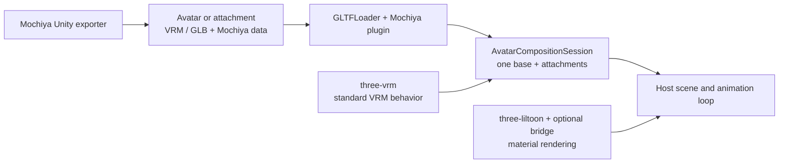

# Mochiya Avatar Asset Runtime

Overlay clothing, hair and other **attachments** on a base avatar in Three.js, with reversible rig binding, fit settings and controls. This package is the maintenance home of the **`MOCHIYA_avatar_asset` glTF extension**, its schema and runtime behavior.



## Avatar or attachment

The runtime follows the Unity exporter's declared kind, including when an attachment contains a humanoid rig.

| `assetKind`  | Unity export rule                                                                                                     | Runtime role                                   |
| ------------ | --------------------------------------------------------------------------------------------------------------------- | ---------------------------------------------- |
| `avatar`     | Own VRM-compatible humanoid and no external Modular Avatar (MA) dependency. May include clothing and child armatures. | Session base; included content stays together. |
| `attachment` | Needs its direct parent's humanoid or has external MA dependencies/effects. That parent must be a valid avatar.       | Added with `session.attach()`.                 |

Both converted kinds carry the extension when exported through Mochiya. Conversion preserves separate armatures; MA owns Unity-side merging. Files without the extension can use host-selected roles and bone-name attachment, without recovered MA actions.

## Extension capabilities

`MOCHIYA_avatar_asset` **0.1** adds attachment relationships and portable actions to glTF/VRM. It lives at the document root, listed in `extensionsUsed`; unaware viewers display the model without these overlays. Geometry, skinning and standard VRM expressions/physics remain in their ordinary formats.

| Capability       | Extension data          | Behavior and limit                                                                                                               |
| ---------------- | ----------------------- | -------------------------------------------------------------------------------------------------------------------------------- |
| `rig.bind`       | `rig.jointMappings`     | Follow base bones while retaining skins/offsets. Unmatched bones retain their rig.                                               |
| `rig.attach`     | `rig.attachmentRoots`   | Parent a local root to a base target; preserve world offset or snap.                                                             |
| `morph.override` | `actions`               | Reversible blendshape fit values, using Unity weight / 100.                                                                      |
| `morph.sync`     | `actions`               | Copy blendshape values with linear/step remapping. No sync chains or cycles.                                                     |
| `node.active`    | `actions`               | Conditional visibility with ancestor awareness. No reactive visibility cycles.                                                   |
| `material.swap`  | `actions`               | Replace a material slot with a file-local alternative.                                                                           |
| `control`        | `controls` + conditions | Numeric/boolean inputs with defaults. No shared MA parameter network.                                                            |
| `collider.link`  | `actions`               | Share VRM colliders with spring joints through explicit links. No automatic cross-asset collisions or experimental angle limits. |

### Data and matching

| Field or rule              | Meaning                                                                                                                            |
| -------------------------- | ---------------------------------------------------------------------------------------------------------------------------------- |
| `specVersion`, `assetKind` | Required: `0.1` and `avatar`/`attachment`. Optional `rig.role` is `avatar`/`attachmentReference` respectively.                     |
| `requiredCapabilities`     | Operations the consumer must support.                                                                                              |
| `matching`, `nodes`        | Armature hints, local node aliases and initial active states.                                                                      |
| `asset: "self"`            | Local node/morph indices. Material indices also address only the current file.                                                     |
| `asset: "base"`            | Bone/mesh/node/blendshape keywords; optional parent hints and humanoid-bone fallback.                                              |
| Conditions                 | Local control or logical node activation, optionally inverted.                                                                     |
| Precedence                 | Base first, then ascending attachment `layerOrder` and instance ID; `sourceOrder` within assets. Later writers win; overlaps warn. |

**Matching is best effort:** missing/ambiguous names skip only affected operations with warnings. No identity, checksum, body-shape or minimum-match gate applies. Good fit still needs suitable geometry, skin weights, bind matrices and rest transforms. Malformed records, invalid local references, unsupported required capabilities and wrong session roles are errors.

Example root-extension fragment: apply a body fit blendshape while the attachment is active.

```json
{
	"extensionsUsed": ["MOCHIYA_avatar_asset"],
	"extensions": {
		"MOCHIYA_avatar_asset": {
			"specVersion": "0.1",
			"assetKind": "attachment",
			"requiredCapabilities": ["morph.override"],
			"actions": [
				{
					"id": "fit-torso",
					"type": "morph.override",
					"target": {
						"asset": "base",
						"meshKeywords": ["Body"],
						"blendshapeKeywords": ["HideTorso"]
					},
					"value": 1
				}
			]
		}
	}
}
```

Contract: [JSON Schema](schema/MOCHIYA_avatar_asset.schema.json) (exported as `@mochiya/avatar-asset-runtime/schema`) and [TypeScript schema](src/schema.ts). Author only current values; `parseManifest()` additionally normalizes legacy `outfit`/`accessory` and `outfitReference` without modifying input.

## Install and try

Use Node.js 20.19+ and a built sibling `three-liltoon/` checkout for the viewer:

```sh
cd avatar-asset-runtime
npm install
npm run build
npm run viewer:dev
# Optional: package the library for installation in another application.
npm pack
```

Open Vite's URL (normally `http://127.0.0.1:5175`). **Load avatar**, then **Add attachment** using your VRM/GLB files. Select an asset to inspect its controls and matching results; hide or remove attachments to undo their effects. Optional base animations use VRMA files. All files stay in the browser.

The viewer starts empty, with Assets, Preview and Inspector always available. Panels stack below the preview on small screens. Lighting and the ground grid use fixed defaults; no demo models or stage settings are included.

Install the tarball in your application with these example peer versions:

```sh
npm install /path/to/mochiya-avatar-asset-runtime-0.1.0.tgz three@0.185.1 @pixiv/three-vrm@3.5.5
```

## Use in Three.js

The host supplies `scene`, the base animation `mixer` and render loop. Prepare assets before adding render helpers.

```ts
import { GLTFLoader } from "three/addons/loaders/GLTFLoader.js";
import { VRMLoaderPlugin, VRMUtils } from "@pixiv/three-vrm";
import {
	MochiyaAvatarAssetLoaderPlugin,
	prepareAvatarAsset,
	AvatarCompositionSession,
	disposeAvatarAsset,
} from "@mochiya/avatar-asset-runtime";

const loader = new GLTFLoader()
	.register((p) => new VRMLoaderPlugin(p))
	.register((p) => new MochiyaAvatarAssetLoaderPlugin(p));

async function load(url: string) {
	const gltf = await loader.loadAsync(url);
	if (gltf.userData.vrm) VRMUtils.rotateVRM0(gltf.userData.vrm);
	return prepareAvatarAsset(gltf);
}

const base = await load("/avatar.vrm");
const attachment = await load("/attachment.vrm");
scene.add(base.scene, attachment.scene);
const session = new AvatarCompositionSession({ base });
const result = session.attach(attachment, { id: "coat", layerOrder: 0 });
console.log(result.status, result.warnings); // attached | partial | unbound

function update(delta: number) {
	// Call once per rendered frame.
	session.beforeVrmUpdate();
	mixer?.update(delta);
	base.vrm?.update(delta);
	scene.updateMatrixWorld(true);
	session.afterVrmUpdate(delta);
}

function hideAttachment() {
	session.setItemState("coat", { visible: false });
}
function cleanup() {
	session.detach("coat");
	disposeAvatarAsset(attachment);
	session.dispose();
	disposeAvatarAsset(base);
}
```

Controls: `setItemState(id, { controls: { controlId: value } })`, `setBaseControl()` and `setBaseMorph()`. The session advances attachment expressions/constraints/springs; update the whole VRM only on the base. Plain GLB has no VRM physics.

Use independent loaded instances per attachment. Detach before disposal; session disposal restores overlays without freeing assets. Changing bases requires a new session and renewed matching.

### Optional lilToon rendering

`three-liltoon` owns material rendering and `MOCHIYA_materials_liltoon`. The optional `/liltoon` bridge handles swaps and VRM material expressions.

| Stage   | Integration                                                                                                                                                                |
| ------- | -------------------------------------------------------------------------------------------------------------------------------------------------------------------------- |
| Load    | Register `GLTFLilToonExtension` with a `LilToonRendererAdapter`, `addOutlines: false`, `configureShadowCasters: false`.                                                    |
| Prepare | Create `LilToonCompositionBridge(adapter)`; install `installLilToonExpressionBindings(vrm)` and `bridge.refresh(mesh)`. Pass the bridge as the session's `materialBridge`. |
| Release | Detach, undo expression bindings, `bridge.release(mesh)`, then dispose the asset; dispose the bridge after the session.                                                    |

Using the imports and `load()` helper above, replace the loader and session setup as follows. `renderer` is your Three.js `WebGLRenderer`.

```ts
import { GLTFLilToonExtension, LilToonRendererAdapter } from "three-liltoon";
import {
	LilToonCompositionBridge,
	installLilToonExpressionBindings,
} from "@mochiya/avatar-asset-runtime/liltoon";

const adapter = new LilToonRendererAdapter(renderer);
const bridge = new LilToonCompositionBridge(adapter);
const loader = new GLTFLoader()
	.register(
		(p) =>
			new GLTFLilToonExtension(p, {
				rendererAdapter: adapter,
				addOutlines: false,
				configureShadowCasters: false,
			}),
	)
	.register((p) => new VRMLoaderPlugin(p))
	.register((p) => new MochiyaAvatarAssetLoaderPlugin(p));

// Load and prepare both assets with this loader before creating the session.
const base = await load("/avatar.vrm");
const attachment = await load("/attachment.vrm");
const undoExpressions = [base, attachment].flatMap((asset) =>
	asset.vrm ? [installLilToonExpressionBindings(asset.vrm)] : [],
);
for (const asset of [base, attachment]) {
	for (const mesh of asset.meshes) bridge.refresh(mesh);
}
scene.add(base.scene, attachment.scene);
const session = new AvatarCompositionSession({ base, materialBridge: bridge });
session.attach(attachment, { id: "coat" });
```

Keep the update loop above. For full cleanup, call `session.dispose()`, each function in `undoExpressions`, and `bridge.dispose()` before disposing both assets.

The [viewer engine](examples/viewer/src/engine.ts) demonstrates setup and cleanup. The bridge expects one material per glTF primitive.

## Contributing

Run `npm run format` after code changes and `npm run format:check` before submitting them. VS Code uses the same Prettier settings on save; generated files and local Unity assets are excluded.

Browser tests generate minimal VRM/GLB inputs in memory; no model binaries are needed in the repository. Unity export validation belongs to the companion exporter's Editor tests.

Edit `src/schema.ts`, regenerate the JSON Schema with `build`, and align exporter mappings. Geometry cutting, arbitrary MA/VRC controllers and automatic body-shape adaptation are outside this package's scope.

```sh
npm run build
npm run typecheck
npm test
npm run viewer:build
npm run test:browser
```
